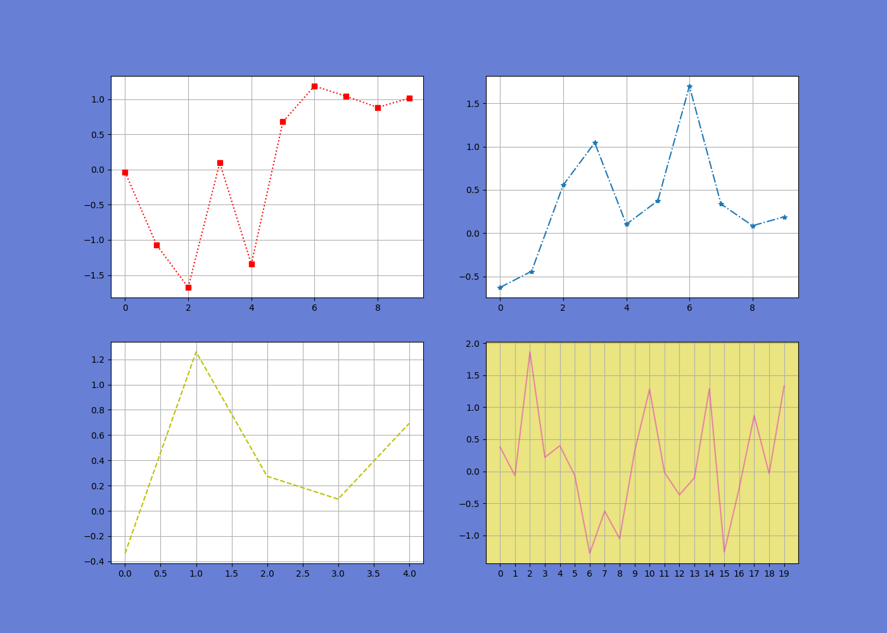

# Сравнение различных библиотек для визуализации данных: Matplotlib, Seaborn и Plotly:

## Содержание
1. [Задачи проекта](#1)
2. [Описание проекта](#2)
3. [Установка](#3)
4. [Реализация проекта](#4)
   - [Библиотека Matplotlib](#4.1)
   - [Библиотека  Seaborn](#4.2)
   - [Библиотека Plotly](#4.3)
5. [Сравнение бибилиотек Matplotlib, Seaborn и Plotly](#5)


<a id="1"></a>
## Задачи проекта
Этот проект предназначен для сравнения трех популярных библиотек Python для визуализации данных: Matplotlib, Seaborn и Plotly.
Мы проведем анализ ключевых особенностей каждой библиотеки, их сильных сторон и областей применения.


<a id="2"></a>
## Описание проекта
В рамках реализации проекта мы построим графики различной сложности. При постройки графиков мы будем использовать как 
созданные случайным образом данные, так и встроенные базы данных.  


<a id="3"></a>
## Установка
Для установки проекта необходимо выполнить установку библиотек. Её можно выполнить по следующей команде:
```sh
pip install -r requirements.txt.
```

<a id="4"></a>
## Реализация проекта

<a id="4.1"></a>
## Библиотека Matplotlib

Matplotlib - это мощная библиотека для создания статистических графиков и диаграмм в Python. Вот подробная информация о преимуществах и недостатках Matplotlib:

### Преимущества Matplotlib
1. Гибкость и настройка:
   - Matplotlib предоставляет широкие возможности для кастомизации графиков, позволяя точно контролировать все аспекты внешнего вида.
   - Можно легко изменять цвета, шрифты, размеры элементов и многое другое.
2. Поддержка различных типов графиков:
   - Библиотека поддерживает множество типов диаграмм, от простых линейных графиков до сложных 3D-представлений.
   - Можно создавать различные виды графиков в одном проекте.
3. Интеграция с другими библиотеками:
   - Matplotlib хорошо интегрируется с другими популярными библиотеками Python для анализа данных, такими как NumPy и Pandas.
   - Это позволяет создавать комплексные решения для визуализации данных.
4. Поддержка интерактивности:
   - Matplotlib поддерживает создание интерактивных графиков, что особенно полезно при разработке веб-приложений.
   - Можно добавлять обработчики событий и взаимодействие с графиками.
5. Документация и сообщество:
   - Matplotlib имеет богатую документацию и активное сообщество разработчиков, что облегчает решение проблем и поиск информации.

### Недостатки Matplotlib
1. Уровень сложности:
   - Хотя Matplotlib очень мощный инструмент, он может быть сложным для начинающих пользователей.
   - Нужно потратить время на изучение документации и практику для эффективного использования.
2. Скорость выполнения:
   - Создание сложных графиков с множеством элементов может быть медленным на некоторых системах.
   - Это может быть проблемой при работе с большими объемами данных или в реальном времени.
3. Ограниченные возможности для создания интерактивных приложений:
   - Хотя Matplotlib поддерживает интерактивность, он не предназначен для создания сложных интерактивных приложений.
   - Для этого лучше использовать специализированные фреймворки, такие как Plotly или Bokeh.
4. Некоторые ограничения в форматировании:
   - Хотя Matplotlib предоставляет широкие возможности для настройки, иногда может быть трудно достичь определенного визуального стиля или форматирования.
5. Отсутствие встроенной поддержки для определенных типов данных:
   - Matplotlib не имеет встроенных инструментов для работы с определенными типами данных, такими как географические координаты или временные ряды.
   - Для этих случаев может потребоваться использование дополнительных библиотек или модификация кода.

В целом, Matplotlib остается одним из наиболее популярных и мощных инструментов для визуализации данных в Python. 
Его преимущества в гибкости и широком спектре возможностей делают его отличным выбором для большинства проектов, связанных с анализом и представлением данных.

<a id="4.2"></a>
## Библиотека Seaborn
Seaborn - это мощная библиотека для создания статистических графиков и диаграмм в Python, основанная на Matplotlib. Вот подробная информация о преимуществах и недостатках Seaborn:

### Преимущества Seaborn
1. Простота использования:
   - Seaborn предоставляет высокоуровневый интерфейс, который упрощает создание сложных визуализаций.
   - Библиотека предлагает готовые функции для создания распространенных статистических графиков, что позволяет быстро получать привлекательные и информативные графики с минимальным кодом.
2. Интеграция с Pandas:
   - Seaborn отлично интегрируется с Pandas, что позволяет работать напрямую с датафреймами.
   - Это упрощает процесс визуализации сложных наборов данных.
3. Встроенные темы и цветовые схемы:
   - Seaborn предлагает несколько встроенных тем и цветовых схем, что облегчает создание эстетически приятных графиков без необходимости вручную настраивать их.
4. Специализированные графики:
   - Seaborn предоставляет специальные типы графиков, такие как violin plots, pair plots и heatmaps, которые сложнее создать с помощью Matplotlib.
5. Гибкость и настройка:
   - Хотя Seaborn упрощает процесс визуализации, он все еще позволяет создавать кастомизированные графики с помощью функций Matplotlib.
6. Поддержка интерактивности:
   - Seaborn поддерживает создание интерактивных и анимированных графиков с помощью других библиотек, таких как Plotly.

### Недостатки Seaborn
1. Скорость выполнения:
   - Seaborn может быть медленным и требовательным к памяти при работе с большими или сложными наборами данных из-за использования Matplotlib в качестве бэкенда.
2. Ограниченная гибкость:
   - Seaborn абстрагирует некоторые детали и опции, которые могут потребоваться для тонкой настройки графиков.
3. Нестабильность:
   - Как относительно новая библиотека, Seaborn может быть менее стабильным и хорошо документированным по сравнению с более зрелыми библиотеками, такими как Matplotlib.
4. Несовместимость:
   - Seaborn может быть менее совместимым с другими библиотеками или фреймворками для визуализации данных.
5. Ограниченные возможности для сложных интерактивных приложений:
   - Хотя Seaborn поддерживает интерактивность, он не предназначен для создания сложных интерактивных приложений.

В целом, Seaborn остается отличным инструментом для статистической визуализации данных, особенно для исследовательской работы и анализа. 
Его простота использования и интеграция с Pandas делают его идеальным выбором для многих проектов.
Однако для более детализированных или кастомизированных графиков может потребоваться использование Matplotlib или других специализированных библиотек.

<a id="4.3"></a>
## Библиотека Plotly
Plotly - это мощная библиотека для создания интерактивных визуализаций данных в Python. Вот подробная информация о преимуществах и недостатках Plotly:

### Преимущества Plotly
1. Интерактивность:
   - Plotly позволяет создавать интерактивные графики, которые можно прокрутить, масштабировать и наводить курсор.
   - Это особенно полезно для исследовательской работы и презентаций данных.
2. Аэстетика и кастомизация:
   - Библиотека предоставляет широкие возможности для настройки внешнего вида графиков, включая цвета, шрифты и аннотации.
   - Это позволяет создавать привлекательные и профессионально выглядящие визуализации.
3. Поддержка различных типов графиков:
   - Plotly поддерживает широкий спектр диаграмм, от простых линейных графиков до сложных 3D-представлений.
4. Интеграция с Pandas:
   - Библиотека легко интегрируется с Pandas DataFrame, что упрощает процесс визуализации данных из таблиц.
5. Встроенные темы и цветовые схемы:
   - Plotly предлагает несколько встроенных тем и цветовых схем для быстрого создания эстетически приятных графиков.
6. Поддержка географических и временных данных:
   - Библиотека предоставляет специальные инструменты для работы с географическими данными и временными рядами.

### Недостатки Plotly
1. Сложность использования:
   - Хотя Plotly предоставляет высокоуровневый интерфейс, он может быть сложным для начинающих пользователей 1.
   - Нужно потратить время на изучение документации и практику для эффективного использования.
2. Скорость выполнения:
   - Создание сложных графиков с множеством элементов может быть медленным на некоторых системах 1.
3. Размер библиотеки:
   - Plotly является относительно крупной библиотекой, что может привести к увеличению времени загрузки проекта 1.
4. Ограниченные возможности для создания сложных интерактивных приложений:
   - Хотя Plotly поддерживает интерактивность, он не предназначен для создания сложных веб-приложений 1.
5. Отсутствие встроенной поддержки для определенных типов данных:
   - Как и другие библиотеки визуализации, Plotly не имеет встроенных инструментов для работы с определенными типами данных, такими как географические координаты или временные ряды 1.

В целом, Plotly остается одним из наиболее популярных и мощных инструментов для визуализации данных в Python. 
Его преимущества в интерактивности и широком спектре возможностей делают его отличным выбором для многих проектов, связанных с анализом и представлением данных.
Однако для более сложных задач может потребоваться использование других инструментов или комбинация Plotly с другими библиотеками.

<a id="5"></a>
## Сравнение бибилиотек Matplotlib, Seaborn и Plotly

<p align="center" style="margin-top: -10px;">Построение графиков в Matplotlib</p>


<p align="center" style="margin-top: -10px;">Построение графиков в Seaborn</p>


<p align="center" style="margin-top: -10px;">Построение графиков в Plotly</p>

Сравнивая Matplotlib, Seaborn и Plotly, можно выделить следующие ключевые особенности каждого инструмента:
### Matplotlib
1. Высокий уровень контроля:
   - Предоставляет максимальную гибкость и возможность тонкой настройки графиков.
   - Идеален для создания специализированных и сложных визуализаций.
2. Широкая поддержка:
   - Поддерживает огромный спектр типов графиков и диаграмм.
   - Может использоваться для создания статичных и интерактивных графиков.
3. Стандартный инструмент:
   - Является стандартным инструментом для визуализации данных в Python.
   - Обладает большой экосистемой и хорошей документацией.
4. Сложность использования:
   - Может быть сложным для начинающих из-за большого количества параметров.
### Seaborn
1. Простота использования:
   - Предоставляет высокоуровневый интерфейс, упрощающий создание графиков.
   - Легко интегрируется с Pandas DataFrame.
2. Эстетика:
   - Предлагает красивые и профессионально выглядящие графики "из коробки".
3. Стандартизация:
   - Помогает поддерживать единообразие стилей в проектах.
4. Ограниченные возможности:
   - Менее гибкий по сравнению с Matplotlib для тонкой настройки.
### Plotly
1. Интерактивность:
   - Предоставляет интерактивные графики, позволяющие прокрутывать, масштабировать и наводить курсор.
2. Эстетика и кастомизация:
   - Предлагает современные и привлекательные внешние виды графиков.
3. Интеграция с Dash:
   - Легко интегрируется с Dash для создания веб-приложений.
4. Поддержка сложных графиков:
   - Хорошо поддерживает 3D-плоты и географические данные.

Для оценки работы с данными библиотека составим **топ** с распределением оценок по различным категориям


| Библиотека | Интерактивность | Простота использования | Эстетика | Гибкость | Производительность | Сумма баллов |
|------------|-----------------|------------------------|----------|----------|--------------------|--------------|
| Matplotlib | 2               | 2                      | 1        | 5        | 5                  | 15           |
| Seaborn    | 4               | 5                      | 4        | 3        | 2                  | 18           |
| Plotly     | 5               | 3                      | 5        | 4        | 3                  | 20           |

**Субъективные оценки** по шкале от __1__ до __5__, где __1__ - худшая, __5__ - лучшая оценка:

Согласно полученного топа можно заметить сильные и слабые стороны каждой из библиотек, но необходимо понимать, что выбор
библиотек зависит от конкретных требований проекта. Выбор можно примерно разделить следующим образом:
   - Для простых и быстрых визуализаций: Seaborn или Plotly.
   - Для тонкой настройки и специализированных графиков: Matplotlib.
   - Для интерактивных веб-приложений: Plotly с Dash.

Не стоит забывать что выбор используемой библиотеки зависит от конкретных задач и предпочтений разработчика.

